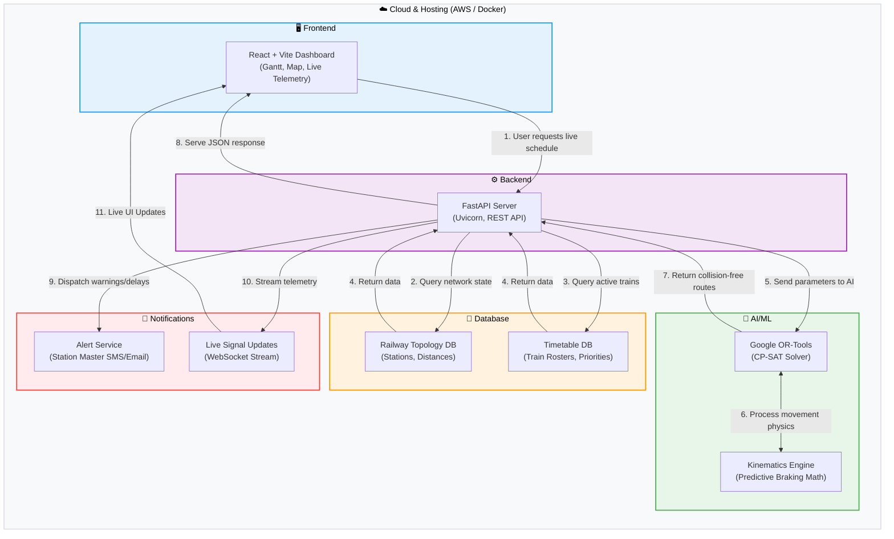

# SIH25022 Train Scheduler - System Architecture & Workflow

This document outlines the end-to-end system architecture and data workflow for the AI-Powered Train Traffic Control system, categorized by the core technological pillars.

## Architectural Breakdown

*   **Frontend:** Built with React and Vite. Handles the user interface, rendering the interactive Gantt chart, the live geographic route map, and the real-time physics telemetry.
*   **Backend:** A Python-based FastAPI server running on Uvicorn. It acts as the central orchestrator, handling API requests, managing data flow, and wrapping the AI models.
*   **AI/ML:** The core intelligence layer powered by Google OR-Tools. It uses a Constraint Programming (CP-SAT) solver to evaluate billions of possible routing combinations in seconds, minimizing weighted delay while strictly enforcing physical kinematics.
*   **Database:** Stores the static railway topology (MAS-CBE station distances, single/double track flags) and dynamic timetable data (train classes, priority weights, scheduled entry times).
*   **Notifications:** The dispatch layer. If the AI detects a delay or modifies a route, this system pushes alerts to Station Masters and streams live signal state changes back to the dashboard.
*   **Cloud & Hosting:** The deployment infrastructure. The frontend can be hosted on edge networks (like Vercel/Netlify), while the backend and AI solver run in containerized Docker environments (e.g., AWS EC2 or Google Cloud Run) for scalable compute power.
